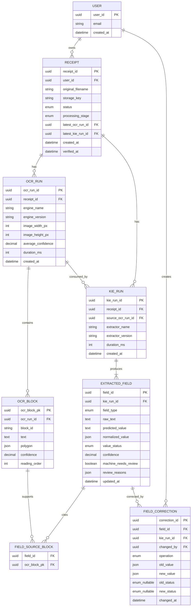
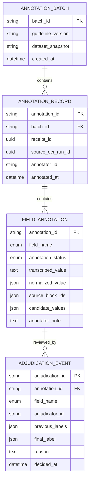

# VietReceipt KIE Data Model and ER Draft

- **Status:** Draft for cross-owner sign-off
- **Version:** 1.0
- **Owner:** Dao Minh Phuong
- **Related issue:** #1
- **Aligned contract:** Shared Integration Contracts v1.3

## 1. Purpose

Tài liệu này mô tả conceptual data model cần để bảo toàn OCR output, KIE prediction, normalized value, human correction và audit history. Đây là ER draft phục vụ thống nhất interface; chưa phải migration SQL cuối cùng và không khẳng định database implementation đã hoàn thành.

Hai miền dữ liệu được tách rõ:

1. **Production processing data:** dữ liệu hệ thống tạo trong luồng upload → OCR → KIE → review → verify.
2. **Annotation/evaluation data:** ground truth dùng để phát triển và đánh giá KIE.

Không lưu ground truth annotation đè lên production prediction hoặc correction history.

## 2. Production ER diagram



Mermaid types chỉ mang tính khái niệm. Backend Owner quyết định SQL types, indexes và migration sau khi contract được sign-off.

## 3. Entity responsibilities

### 3.1 `Receipt`

Đại diện cho một ảnh hóa đơn được người dùng upload.

Thuộc tính nghiệp vụ chính:

- owner `user_id`;
- original filename và private storage key;
- lifecycle `status`;
- `processing_stage` khi đang xử lý;
- con trỏ tới latest successful OCR/KIE run;
- timestamps và safe error metadata.

`Receipt` không trực tiếp sở hữu raw/predicted/corrected values dưới dạng các cột ghi đè lẫn nhau. Dữ liệu chi tiết nằm trong run/field/correction entities.

### 3.2 `OCRRun`

Đại diện cho một lần OCR bất biến.

- Mỗi lần chạy lại tạo `ocr_run_id` mới.
- Engine name/version, image dimensions, duration và confidence là metadata của đúng lần chạy đó.
- Không cập nhật các OCR blocks của run cũ khi reprocess.

### 3.3 `OCRBlock`

Đại diện cho một vùng text OCR.

Invariants đề xuất:

- `block_id` duy nhất trong một `ocr_run_id`;
- `reading_order` duy nhất và zero-based trong OCR run sau OCR Owner sign-off;
- polygon có đúng bốn điểm normalized sau OCR Owner sign-off;
- text và confidence không bị KIE hoặc Backend sửa.

Khóa database nội bộ có thể là UUID riêng hoặc composite key. Public contract chỉ cần `block_id` ổn định trong run.

### 3.4 `KIERun`

Đại diện cho một lần KIE bất biến.

- Thuộc một receipt.
- Trỏ tới chính xác `source_ocr_run_id` đã được sử dụng.
- Lưu extractor name/version và duration.
- Re-run tạo `kie_run_id` mới; không overwrite prediction cũ.

### 3.5 `ExtractedField`

Đại diện cho machine output của một canonical field trong một KIE run.

Invariants:

- unique `(kie_run_id, field_type)`;
- một completed KIE run có đúng năm canonical field types;
- `raw_text`, `predicted_value`, `normalized_value`, `value_status`, `confidence`, `machine_needs_review` và `review_reasons` là immutable machine result;
- non-`PRESENT` có `normalized_value=null`;
- `total_amount` khi `PRESENT` là non-negative integer VND;
- `receipt_date` khi `PRESENT` là ISO `YYYY-MM-DD`;
- `invoice_id` luôn được biểu diễn bằng string để giữ số 0 đầu.

`updated_at` trong public field response là concurrency token cho correction state. Backend có thể lưu token này ngoài immutable KIE columns hoặc trong projection riêng.

### 3.6 `FieldSourceBlock`

Bảng liên kết nhiều-nhiều giữa extracted field và OCR block.

Mục đích:

- audit nguồn của prediction;
- bidirectional highlighting trên Frontend;
- error analysis theo OCR block;
- ngăn KIE tham chiếu block thuộc OCR run khác.

Mỗi source block phải thuộc đúng `source_ocr_run_id` của KIE run.

### 3.7 `FieldCorrection`

Audit record append-only cho mỗi hành động human correction.

Phải lưu:

- field/run context;
- operation `APPLY` hoặc `CLEAR`;
- old/new value;
- old/new status;
- người sửa;
- timestamp.

Correction `value=null`, `value_status=NOT_PRESENT` là một correction thật. Nó không đồng nghĩa với xóa correction.

Xóa correction là operation `CLEAR`, trả field về immutable normalized value/status của KIE run. Với event này, `new_value` và `new_status` có thể là `null`; Backend vẫn phải giữ audit event.

Backend có thể derive active correction từ event mới nhất hoặc lưu một materialized current-correction projection để đọc nhanh. Dù chọn cách nào, event history vẫn append-only và phải phân biệt rõ "explicit correction thành `NOT_PRESENT`" với "clear correction".

## 4. Derived field projection returned by Backend

Backend public API có thể trả một projection kết hợp machine result và correction state:

```text
has_correction = có active human correction

effective_value =
    corrected_value, nếu has_correction = true
    normalized_value, nếu has_correction = false

effective_status =
    corrected_status, nếu has_correction = true
    value_status, nếu has_correction = false
```

`effective_value` không fallback sang `predicted_value`.

Review projection:

```text
machine_needs_review = immutable KIE flag

effective_needs_review =
    false, nếu field/receipt đã được human verify
    false, nếu active correction giải quyết thành PRESENT/NOT_PRESENT/UNREADABLE
    true,  nếu active correction vẫn là AMBIGUOUS/UNKNOWN
    machine_needs_review, nếu chưa có correction
```

Frontend dùng `effective_needs_review` cho current UI. `machine_needs_review` chỉ dùng cho provenance/history.

## 5. Receipt verification invariants

Một receipt chỉ chuyển sang `VERIFIED` khi:

- có đúng năm effective fields;
- không còn unresolved `AMBIGUOUS` hoặc `UNKNOWN`;
- `PRESENT` có effective value đúng canonical type;
- `NOT_PRESENT` và `UNREADABLE` có effective value `null` và đã được con người xác nhận;
- request không dựa trên stale correction state;
- Backend ghi lại actor và thời điểm verify.

Chỉ receipt `VERIFIED` được đưa vào official export và dashboard spending totals theo mặc định.

## 6. Annotation/evaluation data model

Annotation data nằm ngoài production correction flow.



Ground truth không dùng các tên `predicted_value` hoặc `corrected_value`. Điều này giúp tránh nhầm annotation với machine prediction hoặc production human correction.

## 7. Constraints and suggested indexes

Backend Owner cân nhắc các constraints/indexes sau khi thiết kế SQL schema:

- unique `(ocr_run_id, block_id)`;
- unique `(ocr_run_id, reading_order)` sau OCR sign-off;
- unique `(kie_run_id, field_type)`;
- foreign key bảo đảm KIE source run thuộc cùng receipt;
- foreign key/join validation bảo đảm source blocks thuộc source OCR run;
- index receipt theo `(user_id, status, created_at)`;
- index normalized merchant/date/total phục vụ search sau khi verified;
- index correction history theo `(field_id, changed_at)`.

Không index hoặc log raw receipt text rộng hơn nhu cầu nghiệp vụ nếu làm tăng rủi ro dữ liệu nhạy cảm.

## 8. Concurrency and audit notes

- Field correction request dùng `expected_updated_at` hoặc equivalent revision token.
- **NOTE — Backend Owner:** clear-correction và receipt verification cũng cần chiến lược chống lost update; có thể dùng `If-Match`, revision hoặc expected timestamp.
- Mọi state transition đi qua domain service chung.
- Worker retry không được tạo duplicate blocks trong cùng run hoặc overwrite run cũ.
- Deletion phải xử lý cả database records và private image object theo policy của nhóm.

## 9. Owner sign-off checklist

- [ ] Backend xác nhận entity boundaries và effective-value projection.
- [ ] Backend xác nhận correction concurrency/audit strategy.
- [ ] OCR xác nhận polygon, coordinate system, `block_id` và `reading_order`.
- [ ] KIE xác nhận đúng năm fields, run linkage và source-block mapping.
- [ ] Frontend xác nhận có đủ dữ liệu cho bidirectional highlighting và review state.
- [ ] DevOps xác nhận storage/queue không trở thành source of truth cho business state.

Các mục chưa được owner xác nhận phải giữ nguyên dưới dạng pending; không điền thay người phụ trách.
