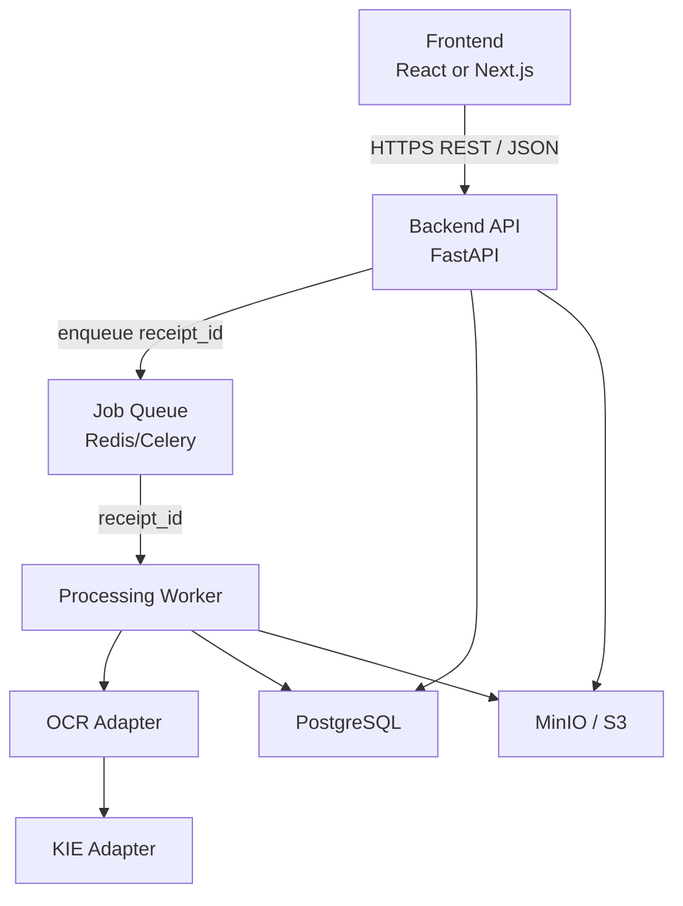
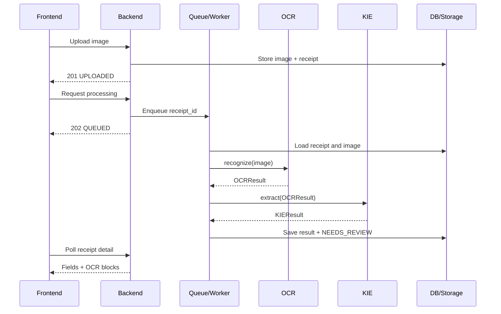

# Architecture v1

## 1. Architectural style

VietReceipt v1 uses a **modular monolith with an asynchronous worker**. FastAPI, the worker, OCR adapter and KIE adapter live in one repository but are isolated behind typed interfaces. This keeps deployment suitable for a student project while allowing OCR/KIE to become independent services later without changing the public API.



## 2. Module responsibilities

| Module | Owns | Must not own |
| --- | --- | --- |
| Frontend | Upload UI, polling, receipt list, review form, bounding-box rendering | OCR/KIE rules, direct database/storage access |
| Backend API | Authentication, authorization, validation, CRUD, state transitions, public API | OCR engine-specific output |
| Worker | Pipeline orchestration, retry boundary, persistence of OCR/KIE results | Public HTTP contract |
| OCR | Image-to-text blocks, polygons, block confidence, reading order | Selecting business fields |
| KIE | Five-field prediction, normalization, field confidence, source-block mapping | Receipt lifecycle or verification |
| PostgreSQL | Structured source of truth and transactional state | Original image bytes |
| Object storage | Original/preprocessed image bytes | Receipt status or field values |
| Queue | Delivery of processing jobs | Durable business state |

## 3. Communication contracts

### Frontend to Backend

- Protocol: HTTPS.
- API style: REST under `/api/v1`.
- Payload: JSON except image upload (`multipart/form-data`).
- Authentication: Bearer access token.
- Long-running behavior: upload and processing return immediately; Frontend polls `GET /api/v1/receipts/{receipt_id}`.
- Frontend never contacts PostgreSQL, MinIO, OCR or KIE directly.

### Backend API to worker

- Backend calls `POST /receipts/{id}/process` and enqueues `{ "receipt_id": "uuid" }`.
- The queue message deliberately contains no image URL or user data.
- Worker loads the current receipt from PostgreSQL and verifies a valid state transition before processing.
- Duplicate delivery is safe: a job for a receipt already `PROCESSING`, `NEEDS_REVIEW` or `VERIFIED` must not create duplicate OCR blocks.

### Worker to OCR

Python interface:

```python
from pathlib import Path

class OCRProvider:
    def recognize(self, *, receipt_id: str, image_path: Path) -> "OCRResult": ...
```

- Worker downloads the image to a temporary local path.
- OCR returns the engine-independent `OCRResult` schema.
- OCR must not update the database or receipt status directly.

### Worker to KIE

Python interface:

```python
class KIEProvider:
    def extract(self, *, receipt_id: str, ocr: "OCRResult") -> "KIEResult": ...
```

- KIE consumes the normalized OCR schema, not raw PaddleOCR objects.
- KIE returns all five field keys.
- KIE must not update the database or receipt status directly.

### Backend/worker to data stores

- PostgreSQL changes are performed through repository/service boundaries.
- Upload order: validate file -> store object -> insert receipt metadata. If metadata insertion fails, schedule orphan-object cleanup.
- Processing result order: calculate OCR/KIE -> open transaction -> replace prior unverified machine result -> set `NEEDS_REVIEW` -> commit.
- Verification order: validate all field values -> create correction history -> update final values -> set `VERIFIED` -> commit.
- Object storage is private. API returns an authorized image endpoint or short-lived signed URL; permanent public URLs are forbidden.

## 4. Processing sequence



## 5. Suggested repository structure

```text
vietreceipt/
  apps/
    api/                  # FastAPI routes and dependency wiring
    worker/               # Celery tasks and pipeline orchestration
  src/vietreceipt/
    domain/               # enums, entities, transition rules
    contracts/            # Pydantic OCR/KIE schemas
    services/             # application use cases
    adapters/
      db/                 # SQLAlchemy repositories
      storage/            # MinIO/S3 implementation
      ocr/                 # OCRProvider implementation
      kie/                 # KIEProvider implementation
  openapi/
  schemas/
  docs/
  tests/
  docker-compose.yml
  .env.example
```

## 6. Failure ownership

| Failure | Owner | External behavior |
| --- | --- | --- |
| Unsupported/oversized upload | Backend | `400` or `413`; receipt is not created |
| Receipt not owned by user | Backend | `404` to avoid leaking existence |
| Invalid state transition | Backend | `409 RECEIPT_STATE_CONFLICT` |
| OCR timeout/error | Worker/OCR | Receipt becomes `FAILED`, stage=`OCR` |
| KIE error | Worker/KIE | Receipt becomes `FAILED`, stage=`KIE` |
| Temporary queue error | Backend/DevOps | `503 PROCESSING_UNAVAILABLE`; receipt remains `UPLOADED` |
| Unknown/missing field | KIE | Field value=`null`, confidence=`0`, receipt still reaches `NEEDS_REVIEW` |

## 7. Security baseline

- Repository and GitHub Project remain private.
- No secrets or real sensitive receipts in Git.
- `.env` is ignored; `.env.example` contains names only.
- Passwords are hashed; tokens and storage credentials never appear in logs.
- Every receipt query is scoped by authenticated `user_id`.
- File content is validated by decoded MIME type, not filename extension alone.
