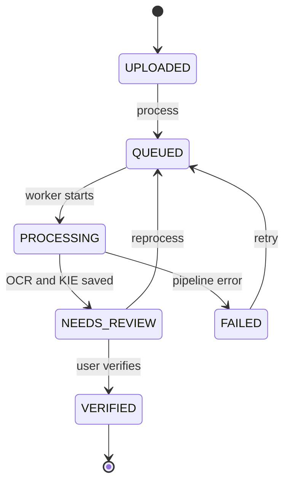

# Receipt State Machine v1

## States

| State | Meaning | User-visible action |
| --- | --- | --- |
| `UPLOADED` | Image and receipt metadata are stored successfully | Start processing, delete |
| `QUEUED` | A processing job has been accepted but not started | View, delete/cancel only if supported later |
| `PROCESSING` | Worker is running preprocessing, OCR or KIE | View progress |
| `NEEDS_REVIEW` | Machine results are stored and await human verification | Review, correct, verify, reprocess |
| `VERIFIED` | User confirmed the final five fields | View, search, export |
| `FAILED` | Pipeline stopped due to a processing failure | View error, retry, delete |

`QUEUED` is included in addition to the five required states so the API can distinguish accepted work from active work.

## Valid transitions



| From | To | Trigger | Actor |
| --- | --- | --- | --- |
| none | `UPLOADED` | Valid image stored and metadata committed | Backend |
| `UPLOADED` | `QUEUED` | `POST /process` accepted | Backend |
| `QUEUED` | `PROCESSING` | Worker locks the job | Worker |
| `PROCESSING` | `NEEDS_REVIEW` | OCR/KIE results persisted | Worker |
| `PROCESSING` | `FAILED` | Unrecoverable/expired processing attempt | Worker |
| `FAILED` | `QUEUED` | Authorized retry | Backend |
| `NEEDS_REVIEW` | `QUEUED` | Explicit reprocess | Backend |
| `NEEDS_REVIEW` | `VERIFIED` | User confirms valid final fields | Backend |

All other transitions return HTTP `409` with code `RECEIPT_STATE_CONFLICT`.

## Invariants

1. `UPLOADED` implies an object-storage key and original filename exist.
2. Only `PROCESSING` may write a new machine prediction set.
3. `NEEDS_REVIEW` implies one OCR result and exactly five extracted field records exist.
4. Missing KIE values are represented by `null`; missing fields do not force `FAILED`.
5. `VERIFIED` implies all required values pass field validation and `verified_at` is non-null.
6. Only `VERIFIED` receipts are included in official export/dashboard spending totals by default.
7. `FAILED` records contain a safe `last_error` object with stage and code; sensitive OCR text is excluded.
8. Retry creates a new processing attempt but does not destroy correction history from an already-reviewed version.
9. Deletion is a separate resource operation, not a receipt status. It must remove or schedule removal of related database rows and image objects.

## Progress stage

Status describes lifecycle; `processing_stage` describes progress while `PROCESSING`:

```text
PREPROCESSING | OCR | KIE | PERSISTING
```

`processing_stage` is `null` outside `PROCESSING`.

## Error representation

```json
{
  "stage": "OCR",
  "code": "OCR_TIMEOUT",
  "message": "OCR processing exceeded the configured time limit.",
  "retryable": true,
  "occurred_at": "2026-08-10T08:30:00Z"
}
```

The public message must be safe for users. Stack traces and receipt text stay in protected server logs.

