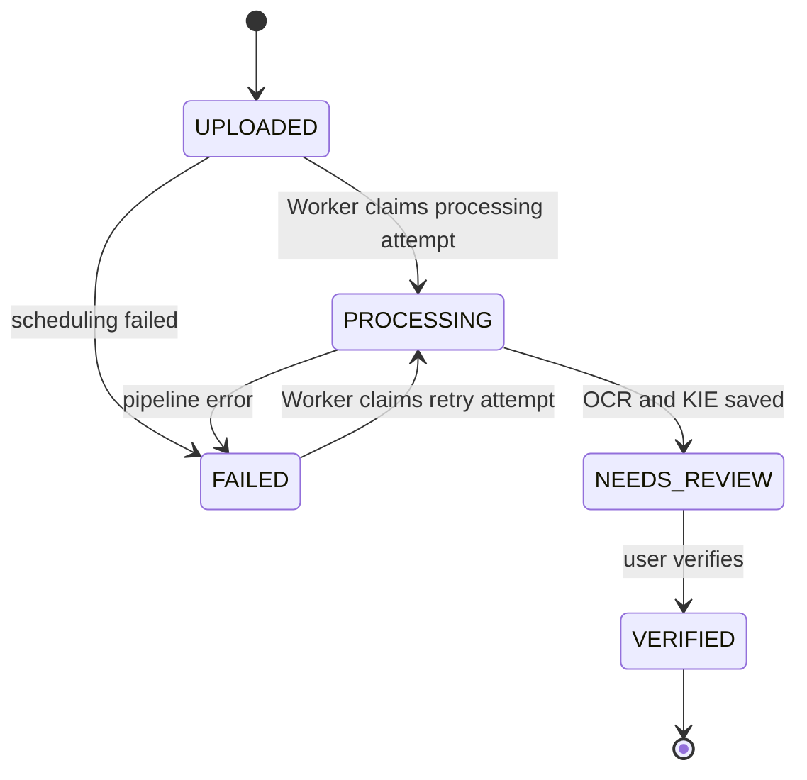

# Receipt State Machine v1

## Canonical states

The public receipt lifecycle has exactly five states:

| State | Meaning | User-visible action |
| --- | --- | --- |
| `UPLOADED` | Image and receipt metadata are committed; Backend may be scheduling an internal job, but no worker has started the processing attempt yet | View or delete |
| `PROCESSING` | A worker has claimed and started a processing attempt and is preprocessing, running OCR/KIE or persisting results | View progress |
| `NEEDS_REVIEW` | Machine results are stored and await human verification | Review, correct and verify |
| `VERIFIED` | User confirmed the effective status/value of all five fields | View, search and export |
| `FAILED` | Pipeline stopped because a processing attempt failed | View error, retry or delete |

`QUEUED` is an internal task-transport condition, not a receipt state and must not cross the public API boundary.

## Valid transitions



| From | To | Trigger | Actor |
| --- | --- | --- | --- |
| none | `UPLOADED` | Valid image stored and metadata committed | Backend |
| `UPLOADED` | `PROCESSING` | A worker claims the scheduled job and starts the processing attempt | Worker |
| `UPLOADED` | `FAILED` | Initial scheduling/enqueue fails after the receipt was committed | Backend |
| `PROCESSING` | `NEEDS_REVIEW` | OCR/KIE results persisted | Worker |
| `PROCESSING` | `FAILED` | Processing attempt fails or expires | Worker |
| `FAILED` | `PROCESSING` | A worker claims an accepted retry and starts the new processing attempt | Worker |
| `NEEDS_REVIEW` | `VERIFIED` | User submits the current receipt concurrency token and all fields are resolved | Backend |

Frontend never calls a public `/process` endpoint. It uploads the image and polls the receipt status. All other transitions return HTTP `409` with code `RECEIPT_STATE_CONFLICT`.

## Invariants

1. `UPLOADED` implies the image and receipt metadata have been committed successfully; it does not imply a worker has started.
2. Backend automatically schedules processing after a successful upload. Successful enqueue/scheduling does not change the public state; task-queue details remain internal.
3. Only `PROCESSING` may append a new machine prediction set; prior OCR/KIE runs are never overwritten.
4. `NEEDS_REVIEW` implies a latest OCR/KIE run and exactly five canonical extracted field records exist.
5. Missing KIE values use `null` plus an explicit `value_status`; missing fields do not force `FAILED`.
6. `VERIFIED` implies every field has a human-resolved `effective_status`; `AMBIGUOUS` and `UNKNOWN` cannot remain unresolved.
7. Verification includes `expected_updated_at` from the latest receipt response. A stale token returns HTTP `409` and does not verify the receipt.
8. Only `VERIFIED` receipts are included in official export/dashboard spending totals by default.
9. `FAILED` records contain a safe `last_error` object with stage and code; sensitive OCR text is excluded.
10. HTTP `202` from retry means the retry was accepted for scheduling. The receipt transitions from `FAILED` to `PROCESSING` only when a worker claims and starts the new attempt; prior OCR/KIE runs and correction history are never destroyed.
11. Deletion is a separate resource operation, not a receipt status. It must remove or schedule removal of related database rows and image objects.

## Scheduling and queue failure

Queue transport is internal and never creates a public `QUEUED` state.

- Initial upload enters `UPLOADED` only after image and receipt metadata are committed.
- Successful enqueue leaves the receipt `UPLOADED`.
- Worker claim/start is the exact transition point to `PROCESSING`.
- If initial scheduling/enqueue fails after commit, Backend transitions `UPLOADED -> FAILED` with `last_error.stage="SCHEDULING"` and `retryable=true`.
- A retry request accepted with HTTP `202` schedules a new attempt but does not itself set `PROCESSING`.
- If retry scheduling fails, the receipt remains `FAILED` with an updated safe scheduling error. A successful retry changes to `PROCESSING` only on worker claim.

This Week 1 contract does not require a transactional outbox. A future reliable outbox/reconciliation implementation may be added without changing these public states or transition semantics.

## Progress stage

Status describes lifecycle; `processing_stage` describes progress while `PROCESSING`:

```text
PREPROCESSING | OCR | KIE | PERSISTING
```

`processing_stage` is `null` outside `PROCESSING`.

## Error representation

```json
{
  "stage": "OCR",
  "code": "OCR_TIMEOUT",
  "message": "OCR processing exceeded the configured time limit.",
  "retryable": true,
  "occurred_at": "2026-08-10T08:30:00Z"
}
```

The public message must be safe for users. Stack traces and receipt text stay in protected server logs.
